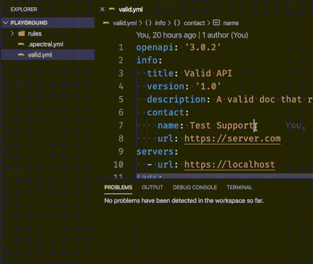

# Spectral Linter for VS Code

> :warning: **DEPRECATED!** I worked with the Stoplight team and they've [created an official Spectral extension based on my code.](https://github.com/stoplightio/vscode-spectral) [**Go install it from the marketplace.**](https://marketplace.visualstudio.com/items?itemName=stoplight.spectral) I won't be enhancing this extension anymore and will, instead, be contributing to theirs.

---

Extension for VS Code to run linting on OpenAPI, JSON, and YAML documents using [Spectral](https://stoplight.io/open-source/spectral/).

Spectral supports linting all types of YAML and JSON documents using [configurable rulesets](https://stoplight.io/p/docs/gh/stoplightio/spectral/docs/getting-started/rulesets.md). It ships by default with [OpenAPI support](https://stoplight.io/p/docs/gh/stoplightio/spectral/docs/getting-started/openapi.md), but you can create your own ruleset.

The extension has Spectral embedded, so there's nothing to install.

## Features

- Automatic detection of `.spectral.yml` or `.spectral.json` ruleset in the same folder as your documents, [just like the CLI](https://stoplight.io/p/docs/gh/stoplightio/spectral/docs/guides/cli.md).
- Configure which documents get linted by language identifier (`json`, `yaml`) and/or by file glob (`**/*.yml`).
- Run linting as you type or on save operations.

## Extension Settings

This extension contributes the following settings:

- `spectral.enable`: Controls whether or not Spectral is enabled.
- `spectral.rulesetFile`: Location of the ruleset file to use when validating. If omitted, the default is a `.spectral.yml`/`.spectral.json` in the same folder as the document being validated. Paths are relative to the workspace.
- `spectral.run`: Run the linter on save (`onSave`) or as you type (`onType`).
- `spectral.validateFiles`: An array of file globs (e.g., `**/*.yaml`) which should be validated by Spectral. If language identifiers are also specified, the file must match both in order to be validated.
- `spectral.validateLanguages`: An array of language IDs (e.g., `yaml`, `json`) which should be validated by Spectral. If file globs are also specified, the file must match both in order to be validated.

## References

- [Spectral home page](https://stoplight.io/open-source/spectral/)
- [Spectral repo on GitHub](https://github.com/stoplightio/spectral)
